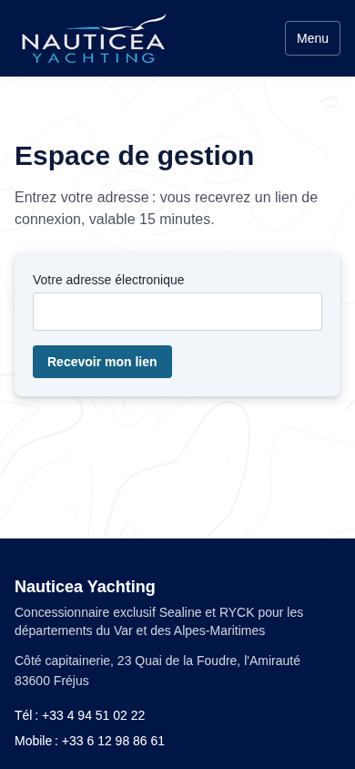
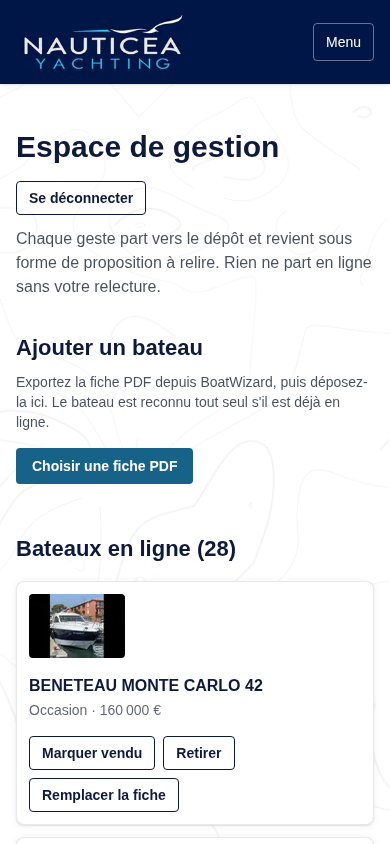
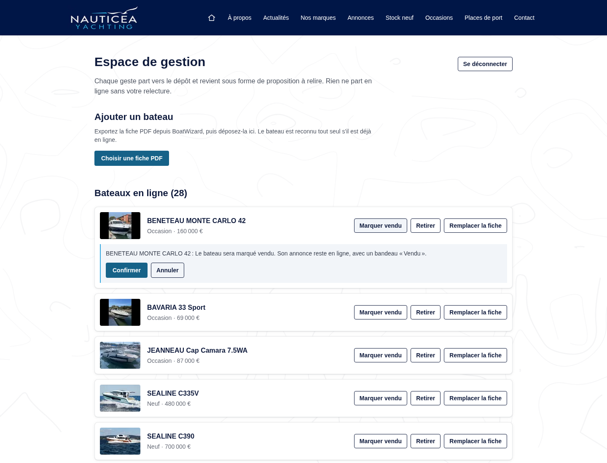

# Espace de gestion

Une page privée du site permet de gérer les bateaux sans passer par
GitHub : `https://www.nauticeayachting.fr/gestion`.

Cette page n'est liée depuis aucune page du site. Notez son adresse dans
vos favoris.

Elle ne remplace pas BoatWizard : c'est toujours là que vous saisissez
vos bateaux. La page sert à déposer la fiche PDF et à dire ce qu'il faut
en faire. Chaque geste devient une proposition que vous relisez avant
publication.

## Se connecter

1. Ouvrez `https://www.nauticeayachting.fr/gestion`.
2. Entrez votre adresse électronique, puis « Recevoir mon lien ».
3. Ouvrez le courriel reçu, cliquez sur le lien. Vous êtes connecté.

Le lien est valable 15 minutes. Une fois connecté, vous le restez
7 jours sur cet appareil, puis il faut redemander un lien.

Il n'y a pas de mot de passe à retenir, et c'est voulu : un mot de passe
se perd, se réutilise et se devine. Le lien, lui, n'arrive que dans votre
boîte.

Si vous entrez une adresse qui n'est pas autorisée, le message affiché est
le même que pour une adresse autorisée. C'est normal : cela évite qu'un
inconnu découvre qui a le droit d'entrer.

## Ajouter un bateau

1. Dans BoatWizard, ouvrez le bateau et exportez sa fiche PDF.
2. Sur la page de gestion, bouton « Choisir une fiche PDF », sélectionnez
   le fichier.
3. Message affiché : « Fiche reçue. L'annonce sera relue puis publiée. »
4. Vous recevez un courriel de récapitulatif, et une proposition s'ouvre
   dans le dépôt.
5. Relisez la proposition, puis fusionnez-la. Le bateau est en ligne une à
   deux minutes plus tard.

Le bateau est reconnu tout seul s'il est déjà en ligne : dans ce cas, ses
textes sont mis à jour et son adresse web ne change pas.

## Mettre à jour un bateau déjà en ligne

Deux chemins, au choix :

- déposer la nouvelle fiche par « Choisir une fiche PDF », comme pour un
  ajout ;
- utiliser « Remplacer la fiche » sur la ligne du bateau, ce qui indique
  d'emblée quel bateau est visé.

Vos photos ne sont jamais dégradées : une photo en ligne n'est remplacée
que si la fiche en offre une meilleure, et les photos que la fiche ne
contient pas sont conservées. Vous pouvez donc redéposer une fiche sans
crainte.

## Marquer un bateau vendu

Sur la ligne du bateau, bouton « Marquer vendu », puis « Confirmer ».

L'annonce reste en ligne, avec un bandeau « Vendu », et l'invitation à
décrire un projet est remplacée par un lien vers les bateaux
disponibles. C'est volontaire : la page continue d'amener des visiteurs,
et un bateau vendu montre que vous vendez.

Pour revenir en arrière, le bouton devient « Remettre en vente ».

## Retirer une annonce

Sur la ligne du bateau, bouton « Retirer », puis « Confirmer ».
L'annonce et ses photos partent du site, et son ancienne adresse renvoie
vers la liste des bateaux, pour qu'aucun lien ne tombe dans le vide.

À réserver aux annonces publiées par erreur. Pour un bateau vendu,
préférez « Marquer vendu » : retirer une page perd son référencement.

## Ce que la page ne fait pas

Elle ne permet pas de taper un prix, un texte ou une caractéristique. Tout
vient de la fiche PDF, donc de BoatWizard. C'est ce qui garantit que le
site, les réseaux d'annonces et votre outil racontent la même chose.

Elle ne publie rien directement. Chaque geste ouvre une proposition à
relire. Rien ne part en ligne sans cette relecture.

## Si quelque chose ne va pas

- **Je ne reçois pas le lien.** Vérifiez les indésirables. Vérifiez aussi
  que vous avez saisi l'adresse figurant dans la liste des personnes
  autorisées.
- **« Cet espace n'est pas encore activé ».** Les réglages d'accès ne sont
  pas posés côté hébergeur. Prévenez votre développeur.
- **« Ce fichier n'est pas un PDF ».** Le fichier déposé n'est pas une
  fiche PDF, ou son export a échoué. Régénérez-la depuis BoatWizard.
- **« Fiche trop lourde ».** La limite est de 30 Mo, jamais atteinte par
  une fiche normale.
- **Un message d'échec revient plusieurs fois.** Le pont avec le dépôt est
  peut-être coupé, par exemple si le jeton d'accès a expiré. Prévenez
  votre développeur, la rotation du jeton est décrite dans
  `docs/GO-LIVE.md`.

## Pour votre développeur

Quatre variables d'environnement, côté hébergeur, décrites dans
`.env.example` : `SESSION_SECRET`, `ADMIN_EMAILS`,
`GITHUB_GESTION_TOKEN`, `GITHUB_GESTION_REPO`. Sans les deux premières, la
page se déclare inactive. Sans les deux dernières, la connexion
fonctionne mais les gestes répondent que le pont n'est pas branché.

Il n'existe pas de révocation d'une session isolée : sans base de données,
la seule révocation est la rotation de `SESSION_SECRET`, qui déconnecte
tout le monde. Retirer une adresse d'`ADMIN_EMAILS` suffit en revanche à
lui couper l'accès immédiatement, même si son cookie court encore.
